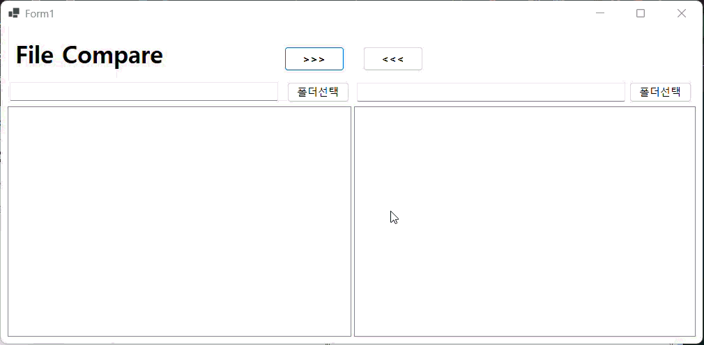
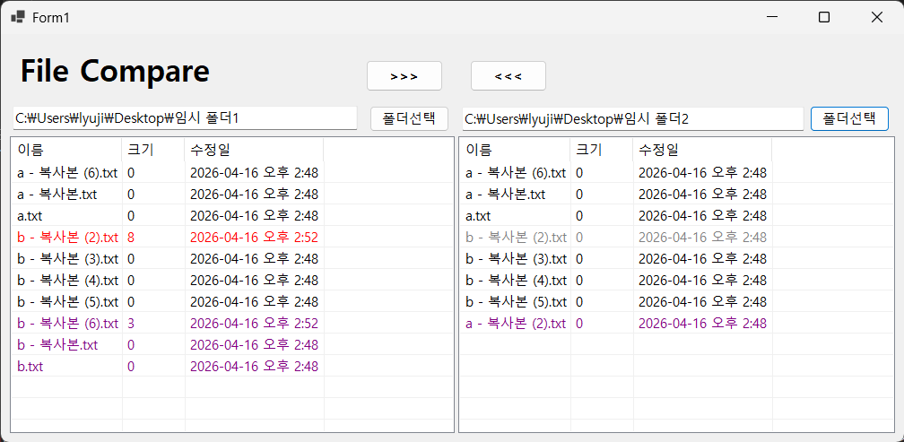

# (C# 코딩) FileCompare

## 개요
-C# 프로그래밍학습
-핵심기능: ...
-화면구성: ...
-사용한 플랫폼:
  -C#, .NET Windows Forms, Visual Studio, GitHub
-사용한 컨트롤:
  -Label, Button, SplitContainer, Panel, ListView
-사용한 기술과 구현한 기능:
    - Label, Button, CheckBox, RadioButton, ListBox, GroupBox, PictureBox 사용
    - Visual Studio를 이용하여 UI 디자인
    - 파일 비교 앱 구현
    - 최신 버전을 색상으로 표시
    - 파일 복사 기능 구현

## 실행 화면(과제1)
-1단계 코드의 실행 스크린샷

-과제 내용
  - 컨트롤 배치와 기본적인 속성 설정
  - 컨트롤 이름 정하기
  - 폴더 선택 기능 구현
-구현 내용과 기능 설명
  - Label, ListView, SplitContainer,  Panel, TextButton UI 배치

## 실행 화면(과제2)
-2단계 코드의 실행 스크린샷

-과제 내용
  - 파일 리스트 기능 구현 (색상 구분 표시)
-구현 내용과 기능 설명
  - 1단계 : 파일이름, 수정시간 비교
  - 2단계 : 동일, New, Old, 단독파일 상태 정의
  - 3단계 : 상태 정의한 파일들의 색상 표시
    - 동일 파일 : 양쪽 모두 검은색
    - 다른 파일 : New는 빨간색, Old는 회색
    - 단독 파일 : 보라색